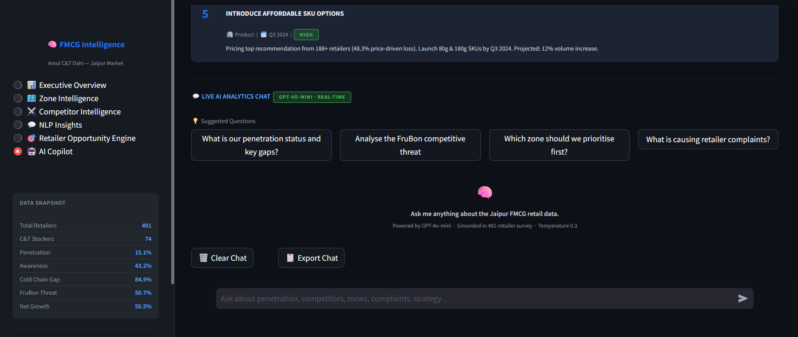
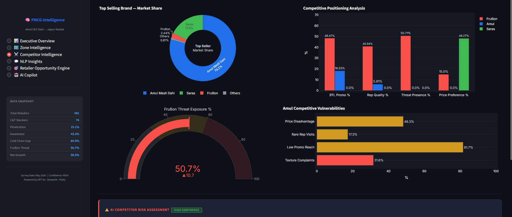
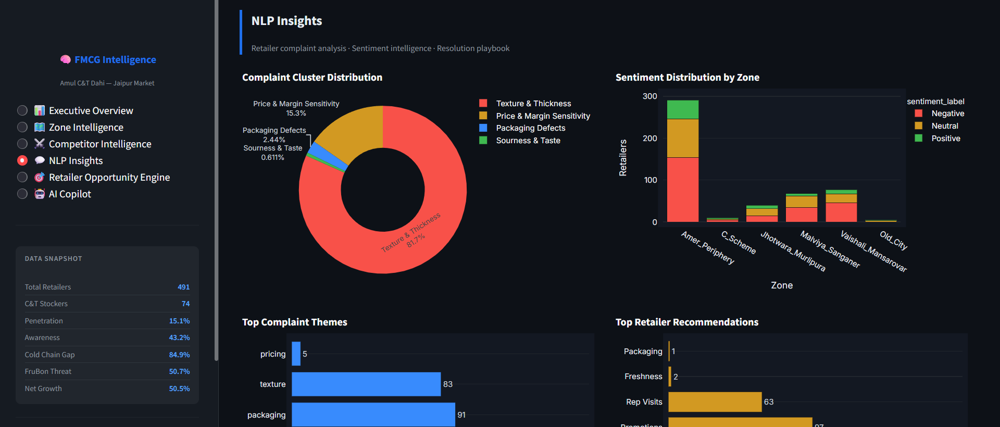
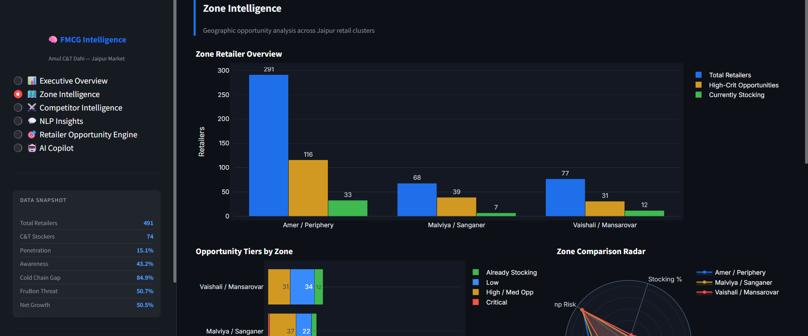
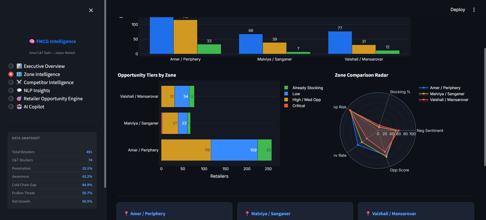

🚀 AI-Powered FMCG Retail Intelligence Platform
An enterprise-grade AI-powered analytics platform built to analyze FMCG retailer intelligence data using ETL pipelines, PostgreSQL, NLP, KPI analytics, OpenAI APIs, and an interactive Streamlit dashboard.
The platform transforms raw retailer survey data into actionable business intelligence insights for market strategy, competitor analysis, retailer opportunity identification, and executive decision-making.
________________________________________
📌 Project Overview
This project was developed to simulate a real-world FMCG business intelligence system capable of:
•	Processing and cleaning retailer-level FMCG datasets
•	Performing KPI analytics and business intelligence reporting
•	Analyzing retailer feedback using NLP techniques
•	Generating AI-powered strategic insights using OpenAI APIs
•	Providing conversational analytics through an AI Copilot
•	Delivering interactive visual dashboards for business decision-making
The system focuses on Amul C&T Dahi retailer intelligence data across multiple zones and retailer segments.
________________________________________
✨ Key Features
🔹 Data Engineering & ETL
•	Automated dataset ingestion pipeline
•	Data cleaning and preprocessing workflows
•	Feature engineering and segmentation
•	Structured CSV exports
•	Modular ETL architecture
🔹 PostgreSQL Data Warehouse
•	Normalized enterprise-grade relational schema
•	Retailer intelligence tables
•	KPI snapshot tables
•	NLP feedback tables
•	Competitor intelligence storage
•	Retailer segmentation architecture
🔹 KPI Analytics Engine
•	C&T penetration analysis
•	Awareness vs stocking conversion analysis
•	Cold-chain infrastructure gap analysis
•	Competitor threat scoring
•	Promotion effectiveness tracking
•	Zone-level performance analytics
•	Retailer opportunity identification
🔹 NLP Feedback Intelligence
•	Sentiment analysis
•	Complaint clustering
•	Topic extraction
•	Retailer recommendation mining
•	Competitor complaint analysis
•	Business summary generation
🔹 OpenAI-Powered Insight Generation
•	Executive summary generation
•	Strategic recommendation generation
•	Competitor risk summaries
•	Zone opportunity intelligence
•	Retailer targeting insights
•	Conversational analytics context generation
🔹 AI Copilot
•	Real-time conversational analytics assistant
•	Dynamic business question answering
•	Context-aware AI insights
•	KPI + NLP grounded responses
•	Strategic recommendation generation
🔹 Interactive Dashboard
•	Streamlit-based enterprise UI
•	KPI cards and analytics panels
•	Competitor intelligence visualizations
•	NLP insight dashboards
•	Retailer opportunity engine
•	AI Copilot integration
________________________________________
🏗️ System Architecture
 
Raw FMCG Dataset
↓
ETL Pipeline
↓
Data Cleaning & Feature Engineering
↓
PostgreSQL Data Warehouse
↓
KPI Analytics Engine
↓
NLP Intelligence Engine
↓
OpenAI Insight Generator
↓
Streamlit Dashboard + AI Copilot
________________________________________
🛠️ Tech Stack
Programming & Analytics
•	Python
•	SQL
•	Pandas
•	NumPy
Database
•	PostgreSQL
•	SQLAlchemy
NLP & AI
•	OpenAI API
•	NLP preprocessing
•	Sentiment analysis
•	Topic modeling
Visualization & Dashboard
•	Streamlit
•	Plotly
Development Tools
•	VS Code
•	Git
•	GitHub
________________________________________
📂 Project Structure
ai-fmcg-retail-intelligence/
│
├── ai/
├── analytics/
├── dashboard/
├── data/
├── database/
├── deployment/
├── etl/
├── logs/
├── ml/
├── nlp/
├── notebooks/
├── tests/
│
├── requirements.txt
├── README.md
└── .gitignore
________________________________________

📊 Business Intelligence Capabilities
The platform can answer business questions such as:
•	Why is C&T penetration low?
•	Which zones have the highest opportunity?
•	What are the biggest retailer complaints?
•	Which competitor poses the highest threat?
•	Which retailers should be targeted first?
•	How effective are trade promotions?
•	What strategic actions should Amul prioritize?
________________________________________
🤖 AI Copilot Example Questions
•	Give me an executive summary of the market
•	Why is C&T penetration low?
•	Which zones have the highest opportunity?
•	What are the top retailer complaints?
•	How can Amul compete against FruBon?
•	Generate a strategic action plan for Amul
________________________________________
📈 Dashboard Modules
Executive Overview
•	Market KPIs
•	Awareness metrics
•	Growth indicators
•	AI-generated executive summaries
Zone Intelligence
•	Zone-wise penetration analysis
•	Opportunity heatmaps
•	Regional competitor threat analysis
Competitor Intelligence
•	FruBon threat analysis
•	Promotion effectiveness
•	Shelf dominance analysis
NLP Insights
•	Complaint clusters
•	Sentiment analysis
•	Retailer recommendation analytics
Retailer Opportunity Engine
•	High-potential retailer targeting
•	Low-awareness opportunity detection
•	Segment-based prioritization
AI Copilot
•	Conversational analytics
•	Dynamic business intelligence queries
•	Real-time AI-generated recommendations
________________________________________
⚙️ Installation & Setup
1️⃣ Clone Repository
git clone https://github.com/yourusername/ai-fmcg-retail-intelligence.git
cd ai-fmcg-retail-intelligence
2️⃣ Create Virtual Environment
python -m venv venv
3️⃣ Activate Environment
Windows
venv\Scripts\activate
Mac/Linux
source venv/bin/activate
4️⃣ Install Dependencies
pip install -r requirements.txt
5️⃣ Configure Environment Variables
Create a .env file:
DB_HOST=localhost
DB_PORT=5433
DB_NAME=amul_ai_intelligence
DB_USER=postgres
DB_PASSWORD=your_password

OPENAI_API_KEY=your_openai_key
OPENAI_MODEL=gpt-4o-mini
6️⃣ Run Streamlit Dashboard
streamlit run dashboard/app.py
________________________________________
📸 Screenshots
# Dashboard Screenshots

## AI Copilot

---

## Competitor Intelligence

---

## NLP Insights

---

## Zone Intelligence

---

## Zone Intelligence Radar

________________________________________
🔥 Project Highlights
✅ Enterprise-style architecture
✅ Real-world FMCG retailer intelligence use case
✅ AI-powered business analytics
✅ OpenAI-integrated conversational analytics
✅ PostgreSQL data warehouse design
✅ KPI and NLP intelligence engine
✅ Interactive Streamlit dashboard
________________________________________

🚀 Future Improvements
•	Deployment on Streamlit Cloud / Render
•	Real-time retailer data ingestion
•	Advanced ML forecasting models
•	Role-based dashboard authentication
•	Vector database integration
•	RAG-based conversational analytics
•	Automated reporting pipelines
________________________________________
👨‍💻 Author
Piyush Dani
Apprentice at NVIDIA | MCA Student | Data Analytics & AI Enthusiast

